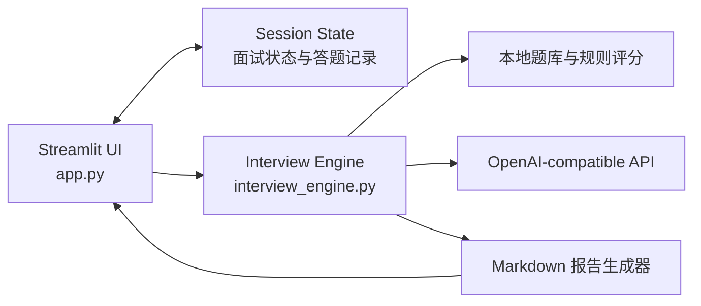
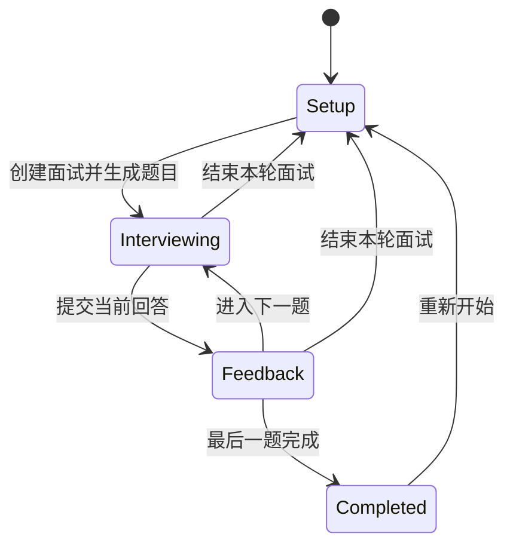

# AI 面试模拟官

基于 Streamlit 和 OpenAI-compatible API 构建的状态化模拟面试应用。系统支持岗位配置、动态出题、逐题回答、结构化评分、反馈展示和 Markdown 报告导出，并提供不依赖外部模型服务的本地演示模式。

## 功能概览

- 内置 AI 应用开发、Python 后端、前端开发、数据分析和产品经理岗位题库
- 支持自定义岗位、面试难度、面试类型和题目数量
- 支持综合面试、技术面试、项目面试和行为面试
- 基于候选人背景动态生成个性化面试题
- 按岗位相关性、表达清晰度、案例与证据、思考深度进行四维评分
- 输出回答优点、改进建议、参考表达和后续追问
- 使用 Session State 管理多步骤面试状态和历史记录
- 支持 OpenAI、DeepSeek、通义千问及其他 OpenAI 兼容接口
- 支持无 API Key 的确定性演示模式
- 支持生成和下载完整 Markdown 面试报告

## 系统架构



应用由两个主要模块组成：

- `app.py`：负责页面渲染、表单交互、模式配置、Session State 状态流转和异常提示。
- `interview_engine.py`：负责题库、Prompt 构造、模型调用、JSON 解析、结果校验、演示评分、统计计算和报告生成。

界面层不直接实现评分规则或报告拼接，核心业务逻辑可以脱离 Streamlit 单独测试。

## 状态流转



`app.py` 使用以下 Session State 字段维护状态：

| 字段 | 类型 | 作用 |
| --- | --- | --- |
| `interview_started` | `bool` | 标记面试是否已经创建 |
| `interview_complete` | `bool` | 标记全部题目是否完成 |
| `questions` | `list[dict]` | 保存本轮面试题目 |
| `current_index` | `int` | 当前题目索引 |
| `current_feedback` | `dict \| None` | 当前题目的评分反馈 |
| `records` | `list[dict]` | 保存已完成题目的回答与反馈 |
| `interview_config` | `dict` | 保存岗位、难度、类型、题数和运行模式 |

每道题提交成功后才会写入 `records`。模型调用失败或返回无法解析的数据时，当前题目不会推进，用户可以修正配置后重试。

## 项目结构

```text
ai-interview-coach/
|-- app.py
|-- interview_engine.py
|-- requirements.txt
|-- runtime.txt
|-- .env.example
|-- .gitignore
|-- .streamlit/
|   `-- config.toml
|-- tests/
|   `-- test_interview_engine.py
|-- README.md
`-- LICENSE
```

## 技术栈

| 组件 | 用途 |
| --- | --- |
| Python 3.11 | 应用运行环境 |
| Streamlit | Web UI、表单、会话状态和报告下载 |
| OpenAI Python SDK | 调用 OpenAI-compatible Chat Completions API |
| python-dotenv | 本地环境变量加载 |
| unittest | 核心业务逻辑测试 |

依赖版本范围定义在 `requirements.txt`，部署环境使用 `runtime.txt` 指定 Python 3.11。

## 核心实现

### 题目生成

系统提供两条题目生成路径：

1. 演示模式调用 `generate_demo_questions()`，从岗位题库和通用题库中按顺序选题并去重。
2. 大模型模式调用 `generate_ai_questions()`，根据岗位、难度、面试类型、题目数量和背景信息构造 Prompt。

模型被要求返回以下 JSON 数据：

```json
{
  "questions": [
    {
      "question": "请介绍一个你完成的项目。",
      "focus": "项目经验与个人贡献"
    }
  ]
}
```

`_normalise_questions()` 会完成以下处理：

- 兼容顶层数组和包含 `questions` 字段的对象
- 丢弃类型错误或缺少问题文本的条目
- 为缺失的 `focus` 提供默认值
- 限制返回题目数量
- 当模型返回题目不足时使用本地题库补齐
- 通过题目文本去重

### 回答评分

大模型模式通过 `evaluate_ai_answer()` 生成结构化反馈。评分包含四个维度：

| 字段 | 含义 |
| --- | --- |
| `relevance` | 回答是否紧扣问题和目标岗位 |
| `clarity` | 表达是否有结构且容易理解 |
| `evidence` | 是否包含具体行动、案例、数据或结果 |
| `depth` | 是否体现原理、取舍、复盘或改进思路 |

模型响应契约如下：

```json
{
  "score": 78,
  "dimensions": {
    "relevance": 82,
    "clarity": 80,
    "evidence": 70,
    "depth": 79
  },
  "strengths": [
    "回答能够说明个人负责的工作"
  ],
  "improvements": [
    "补充可验证的项目结果"
  ],
  "better_answer": "改进后的参考表达",
  "follow_up": "面试官后续追问"
}
```

`_normalise_feedback()` 不直接信任模型输出，而是执行字段级校验：

- 确认顶层数据为 JSON 对象
- 将所有分数转换为整数并限制在 `0-100`
- 为缺失的评分维度提供默认分数
- 清理空的优点和建议列表
- 限制优点与建议的返回数量
- 为缺失的参考回答和追问提供兜底文本

### JSON 提取

模型可能返回 Markdown 代码块或在 JSON 前后添加说明。`_extract_json()` 会：

1. 去除外层 Markdown JSON 代码块。
2. 从响应中扫描第一个 `{` 或 `[`。
3. 使用 `json.JSONDecoder.raw_decode()` 解析首个有效 JSON 对象或数组。
4. 未找到有效 JSON 时抛出明确异常。

该逻辑只负责结构提取，字段合法性由后续标准化函数处理。

### 演示评分算法

演示模式不调用大模型。`evaluate_demo_answer()` 使用可复现的启发式规则计算评分，检测特征包括：

- 回答文本长度
- 是否包含“首先、其次、最后”等结构词
- 是否包含“我负责、我使用、我完成”等个人行动表达
- 是否包含结果、提升、降低、百分比等结果标记
- 是否包含数字
- 回答与考察点之间的关键词重合
- 是否包含原因、改进或复盘表达

规则分别计算四个维度，再取平均值得到综合分。该模式用于离线运行、UI 流程验证和自动化演示，不用于替代真实模型评价。

### 报告生成

`build_markdown_report()` 根据 `interview_config` 和 `records` 生成 Markdown 文本，内容包括：

- 面试配置与完成题数
- 综合平均分
- 四个评分维度的平均值
- 相对最高和最低的评分维度
- 每道题的问题、考察点、原始回答、分数和建议
- 每道题的参考表达

报告仅在内存中生成，通过 Streamlit `download_button` 返回，不写入服务端磁盘。

## 安装

推荐使用 Python 3.10 至 3.12。

### Windows PowerShell

```powershell
git clone https://github.com/zhangbeilin22-sketch/ai-interview-coach-AI-.git
cd ai-interview-coach-AI-
python -m venv .venv
.\.venv\Scripts\Activate.ps1
python -m pip install --upgrade pip
python -m pip install -r requirements.txt
```

### macOS / Linux

```bash
git clone https://github.com/zhangbeilin22-sketch/ai-interview-coach-AI-.git
cd ai-interview-coach-AI-
python3 -m venv .venv
source .venv/bin/activate
python -m pip install --upgrade pip
python -m pip install -r requirements.txt
```

## 配置

### 演示模式

演示模式不需要任何环境变量，可以直接启动。

### 大模型模式

复制环境变量模板：

```powershell
Copy-Item .env.example .env
```

macOS 或 Linux：

```bash
cp .env.example .env
```

编辑 `.env`：

```env
AI_API_KEY=your_api_key
AI_BASE_URL=https://api.openai.com/v1
AI_MODEL=gpt-4.1-mini
```

| 变量 | 必填 | 说明 |
| --- | --- | --- |
| `AI_API_KEY` | 大模型模式必填 | 模型服务商提供的 API Key |
| `AI_BASE_URL` | 必填 | OpenAI 兼容接口地址 |
| `AI_MODEL` | 必填 | Chat Completions 模型名称 |
| `OPENAI_API_KEY` | 否 | `AI_API_KEY` 未设置时使用的兼容变量 |

应用侧边栏内置以下服务商预设：

| 服务商 | Base URL | 默认模型 |
| --- | --- | --- |
| OpenAI | `https://api.openai.com/v1` | `gpt-4.1-mini` |
| DeepSeek | `https://api.deepseek.com` | `deepseek-chat` |
| 通义千问 | `https://dashscope.aliyuncs.com/compatible-mode/v1` | `qwen-plus` |
| 自定义接口 | 读取环境变量 | 读取环境变量 |

模型名称和接口地址可能由服务商调整，部署前应根据对应服务商文档更新配置。

## 运行

```powershell
streamlit run app.py
```

默认访问地址：

```text
http://localhost:8501
```

应用启动后的处理流程：

1. 选择演示模式或大模型模式。
2. 配置岗位、难度、面试类型和题目数量。
3. 生成题目并进入逐题回答状态。
4. 提交回答并查看结构化反馈。
5. 完成全部题目后查看汇总结果。
6. 下载 Markdown 报告。

## 测试

项目测试使用 Python 标准库 `unittest`，无需额外测试依赖：

```powershell
python -m unittest discover -s tests -v
```

当前测试覆盖：

- 演示题目数量和去重
- 自定义岗位的通用题库回退
- Markdown 代码块中的 JSON 提取
- 详细回答与过短回答的评分差异
- 报告中的配置、分数和回答内容

也可以单独执行语法检查：

```powershell
python -m py_compile app.py interview_engine.py
```

## 部署

项目可以直接部署到 Streamlit Community Cloud：

1. 连接包含本项目的 GitHub 仓库。
2. 将入口文件设置为 `app.py`。
3. 使用 `runtime.txt` 中声明的 Python 版本。
4. 演示模式无需配置 Secrets。
5. 大模型模式需要在应用 Secrets 中配置模型参数。

Streamlit Secrets 示例：

```toml
AI_API_KEY = "your_api_key"
AI_BASE_URL = "https://api.openai.com/v1"
AI_MODEL = "gpt-4.1-mini"
```

Secrets 不应写入仓库中的 `.streamlit/config.toml`。本地 `.streamlit/secrets.toml` 已通过 `.gitignore` 排除。

## 安全设计

- `.env` 和 `.streamlit/secrets.toml` 不进入版本控制
- API Key 输入框使用密码类型，不在页面中明文展示
- API Key 仅保存在当前应用进程的会话内存中，不写入报告或服务端文件
- 用户背景和回答使用 XML 风格边界标记包裹，并在 Prompt 中声明为不可执行数据
- 模型输出作为不可信数据处理，必须经过 JSON 解析和字段标准化
- 分数统一限制在 `0-100`，避免异常值影响汇总
- 报告下载不包含 API Key、Base URL 或模型认证信息

生产部署仍应配置请求频率限制、服务端日志脱敏、内容审核和调用成本监控。

## 异常处理

| 场景 | 处理方式 |
| --- | --- |
| 大模型模式未填写 API Key | 阻止创建面试并显示错误信息 |
| 模型请求超时或接口错误 | 保留当前状态并显示异常原因 |
| 模型题目数量不足 | 使用本地题库补齐 |
| 模型返回 Markdown 代码块 | 提取其中首个有效 JSON |
| 反馈字段缺失或分数越界 | 使用默认值并执行分数裁剪 |
| 回答少于 10 个字符 | 阻止提交并提示补充内容 |
| 用户主动结束面试 | 清理本轮 Session State 并返回配置页 |

## 已知限制

- 当前模型调用基于 Chat Completions 接口，不包含流式输出
- 面试记录仅保存在当前浏览器会话中，刷新或服务重启后可能丢失
- 演示模式评分基于规则，不具备语义理解能力
- 大模型评分可能存在随机性，不同服务商的结果可能不同
- 当前没有用户系统、数据库、调用配额和历史记录管理
- 未实现语音输入、语音合成或实时视频面试

## 扩展方向

- 使用 Pydantic 或 JSON Schema 实现更严格的响应校验
- 增加流式生成和请求取消
- 增加模型重试、指数退避、超时分类和限流处理
- 接入数据库保存面试历史和评分趋势
- 增加岗位题库配置文件和后台管理接口
- 增加语音识别、语音合成和限时回答
- 增加 Prompt 版本管理和离线评估数据集
- 增加 API 调用耗时、Token 用量和成本统计
- 增加端到端浏览器测试和持续集成工作流

## License

本项目使用 MIT License，详见 `LICENSE`。
